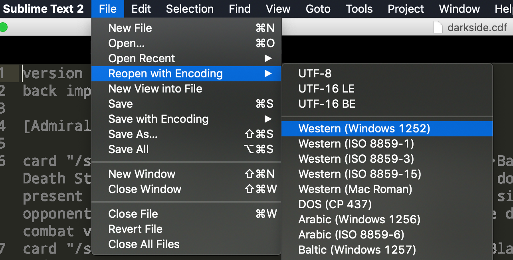

Holotable Card Data Files
=========================

Up to date card data for use with **Holotable**.

After installing Holotable on Windows or Linux, use the Card Data Files _(CDF)_ on this site to update Holotable to the latest SWCCG release.

## Card Images

* Images are in the `Images-HT/starwars/` subdirectory.
  * Subdirectories within `starwars` contain sets, 1 for each side of the force. For example:
    - `EnhancedPremiere-Dark`
    - `EnhancedPremiere-Light`
  * Within the set directories, there are _very small_ **gif** images, each with a filename prefix of `t_`.<br />For example: `t_hanwithheavyblasterpistol.gif`
  * Within the set directories, the `large/` directory contains _large_ **gif** images.
  * Within the set directories, the `hires/` directory contains _high resolution_ **png** images. The holotable app has no knowledge of the png images within the `hires/` directory.
* Card images are used by: **Holotable**, **GEMP**, and **SCOMP**.
* Card images are served from `res.starwarsccg.org/cards`.
* Card images are automatically uploaded to `res.starwarsccg.org/cards` when merging to the `main` branch.

## Image Dimensions

Images used by **Holotable** are small and large. There are two sizes of large images. The newer large size is to accomodate larger screens and a desire to actually be able to read the text on a card.

* **Small Images**: 67x87 RGB 72dpi gif
* **_Old_ Large Images**: 350x490 RGB 72dpi gif
* **current Large Images**: 745x1039 RGB 120dpi gif
* **High Resolution Images**: 703×980 RGB 120dpi png

### Automatic Image Creation

* All `t_` small gif images, and `large/` gif images, will be generated automatically from High Resolution images uploaded to the `hires/` subdirectory.

### Creating t_gif files using `ImageMagick`

```bash
convert -quality 72 -resize 67x87 large/FILENAME.gif t_FILENAME.gif
```

### Creating large gif files using `ImageMagick`

```bash
convert -quality 120 -resize 745x1039 hires/FILENAME.gif hires/FILENAME.png
```


## branch name

* The default branch name needs to be renamed to `main`.
* Unfortunately, the default branch needs to remain `master` until an update to `www.holotable.com/version.dat` can be released.
* `www.holotable.com/version.dat` has a reference to the `listmd5` file stored on GitHub in the `master` branch.
* `www.holotable.com/version.dat` requires that `listmd5.bz2` can be downloaded from:<br />`https://raw.githubusercontent.com/swccgpc/holotable/master/Images-HT/listmd5.bz2`


## Downloading images from GitHub using `holotable`

* The `listmd5` file contains an index of images in the GitHub `holotable` repo.
* `holotable` downloads the `listmd5` file from GitHub to update its local image cache.
* `github.com` is an `SSL` encrypted website, meaning that the `holotable` client must support `https` encrypted URLs.
* To support download `listmd5` and images from GitHub, `holotable` version 0.9.10 must be installed.
* `holotable` 0.9.10 requires at least Windows 7 and will not run correctly on Windows XP.


## `version.dat`

* Served from the Holotable server: <br />`curl http://www.holotable.com/version.dat`
* The `holotable` client uses `version.dat` to determine if there are any client updates available.

| Line Number | contents |
| ----------- | -------- |
| Line 1      | current version string |
| Line 2/3    | `Light/Dark CDF YYYYmmdd bzip2-compress-file-download-url sha256-hash-of-download-file` |
| Line 4/5    | `Holotable Windows/Linux exe/unpack VERSION file-download-url sha256-hash-of-download-file` |
| Line 6      | `images YYYYmmdd bzip2-compress-file-download-url sha256-hash-of-download-file` |
| Line 7      | `imagelisturl YYYYmmdd bzip2-compress-file-download-url sha256-hash-of-download-file` |

```
0.9.10
Light CDF 20190821 download/downloads/lightside.cdf.bz2 SHA256:5982864dc7747432371da14fce3316d3962f096c78a83da3991e79ea473dcd57
Dark CDF 20191020 download/downloads/darkside.cdf.bz2 SHA256:a5af394fe28ddea35fa439d4c538e3006e05703ad36419045177b14e1b933139
Holotable Windows exe 0.9.10 download/downloads/holotable-0.9.10_update.exe SHA256:628460f5f430c6d092908366ee3fbe271d2d7c5486d9c6b9909c5e9dabd3c2ba
Holotable Linux unpack 0.9.9 download/downloads/holotable-0.9.9_update_linux.tar.bz2 SHA256:415bea412fdbe426a9877ef7d3ad3dee2348adf0e10579dace35e80b788c7bdf
images 20180719 download/downloads/cards/listmd5.bz2 SHA256:20f07f15bc375fb6fe7b2af42f9eddbb888b18ff50f798e4c74cbbe79f09b803
imagelisturl 20190118 https://raw.githubusercontent.com/swccgpc/holotable/master/Images-HT/listmd5.bz2
## SHA256:e6926f6444f86c1e9d9c95d69c74fb32ebbee3a4f7599ae88899d4d534363deb
```


### Download URL's

* Only the `imagelisturl` accepts a download URL that is **NOT** a path relative to the `www.holotable.com` server.<br />For example:
```
https://raw.githubusercontent.com/swccgpc/holotable/master/Images-HT/listmd5.bz2
```

* `Light CDF`, `Dark CDF`, `Holotable Windows`, `Holotable Linux`, and `images` all expect a relative path without a leading slash `(/)`.<br />For example:
```
download/downloads/cards/listmd5.bz2
```


### Serving in such a way that `holotable` can consume `version.dat`

* Holotable requires that the `Content-Type` header is set.
* Holotable requires that there is at least a single line _after_ the `Content-Length` header.

```
< HTTP/1.1 200 OK
< Date: Sun, 07 Feb 2021 15:00:30 GMT
< Server: Apache/2.4.6 (CentOS) OpenSSL/1.0.2k-fips PHP/7.4.4
< Last-Modified: Mon, 21 Oct 2019 01:57:39 GMT
< ETag: "c6a-59562022f7377"
< Accept-Ranges: bytes
< Content-Length: 3178
< Content-Type: text/plain
<
```

* Using `apache2`, we can force the `Content-Type` of the `version.dat` file to be `text/plain` with a config file:

**/etc/apache2/conf-enabled/version_dat_content_type.conf**
```
<Files "version.dat">
    ForceType text/plain
</Files>
```

### Old hacks to enable `Content-Type` header not required

* The `version.dat` file formerly used a hack to enable the `Content-Type` header where it placed 20 rows of 100 x `m`'s at the bottom of the file.
* When forcing the `version.dat` `Content-Type` to be `text/plain` using the server configuration override, the `m`'s hack is not needed.
* In reality, the `m`'s hack does not work on modern Apache servers anyway, and might have been something specific to the legacy hosting provider.

```

Something about this extra stuff (including this line) weirdly causes the web server to send an extra "Content-Type:" line in the HTTP header, which is needed for Holotable to process this file correctly.  There has to be at least one line after the "Content-Length:" line in the header.
mmmmmmmmmmmmmmmmmmmmmmmmmmmmmmmmmmmmmmmmmmmmmmmmmmmmmmmmmmmmmmmmmmmmmmmmmmmmmmmmmmmmmmmmmmmmmmmmmmmm
mmmmmmmmmmmmmmmmmmmmmmmmmmmmmmmmmmmmmmmmmmmmmmmmmmmmmmmmmmmmmmmmmmmmmmmmmmmmmmmmmmmmmmmmmmmmmmmmmmmm
mmmmmmmmmmmmmmmmmmmmmmmmmmmmmmmmmmmmmmmmmmmmmmmmmmmmmmmmmmmmmmmmmmmmmmmmmmmmmmmmmmmmmmmmmmmmmmmmmmmm
mmmmmmmmmmmmmmmmmmmmmmmmmmmmmmmmmmmmmmmmmmmmmmmmmmmmmmmmmmmmmmmmmmmmmmmmmmmmmmmmmmmmmmmmmmmmmmmmmmmm
mmmmmmmmmmmmmmmmmmmmmmmmmmmmmmmmmmmmmmmmmmmmmmmmmmmmmmmmmmmmmmmmmmmmmmmmmmmmmmmmmmmmmmmmmmmmmmmmmmmm
mmmmmmmmmmmmmmmmmmmmmmmmmmmmmmmmmmmmmmmmmmmmmmmmmmmmmmmmmmmmmmmmmmmmmmmmmmmmmmmmmmmmmmmmmmmmmmmmmmmm
mmmmmmmmmmmmmmmmmmmmmmmmmmmmmmmmmmmmmmmmmmmmmmmmmmmmmmmmmmmmmmmmmmmmmmmmmmmmmmmmmmmmmmmmmmmmmmmmmmmm
mmmmmmmmmmmmmmmmmmmmmmmmmmmmmmmmmmmmmmmmmmmmmmmmmmmmmmmmmmmmmmmmmmmmmmmmmmmmmmmmmmmmmmmmmmmmmmmmmmmm
mmmmmmmmmmmmmmmmmmmmmmmmmmmmmmmmmmmmmmmmmmmmmmmmmmmmmmmmmmmmmmmmmmmmmmmmmmmmmmmmmmmmmmmmmmmmmmmmmmmm
mmmmmmmmmmmmmmmmmmmmmmmmmmmmmmmmmmmmmmmmmmmmmmmmmmmmmmmmmmmmmmmmmmmmmmmmmmmmmmmmmmmmmmmmmmmmmmmmmmmm
mmmmmmmmmmmmmmmmmmmmmmmmmmmmmmmmmmmmmmmmmmmmmmmmmmmmmmmmmmmmmmmmmmmmmmmmmmmmmmmmmmmmmmmmmmmmmmmmmmmm
mmmmmmmmmmmmmmmmmmmmmmmmmmmmmmmmmmmmmmmmmmmmmmmmmmmmmmmmmmmmmmmmmmmmmmmmmmmmmmmmmmmmmmmmmmmmmmmmmmmm
mmmmmmmmmmmmmmmmmmmmmmmmmmmmmmmmmmmmmmmmmmmmmmmmmmmmmmmmmmmmmmmmmmmmmmmmmmmmmmmmmmmmmmmmmmmmmmmmmmmm
mmmmmmmmmmmmmmmmmmmmmmmmmmmmmmmmmmmmmmmmmmmmmmmmmmmmmmmmmmmmmmmmmmmmmmmmmmmmmmmmmmmmmmmmmmmmmmmmmmmm
mmmmmmmmmmmmmmmmmmmmmmmmmmmmmmmmmmmmmmmmmmmmmmmmmmmmmmmmmmmmmmmmmmmmmmmmmmmmmmmmmmmmmmmmmmmmmmmmmmmm
mmmmmmmmmmmmmmmmmmmmmmmmmmmmmmmmmmmmmmmmmmmmmmmmmmmmmmmmmmmmmmmmmmmmmmmmmmmmmmmmmmmmmmmmmmmmmmmmmmmm
mmmmmmmmmmmmmmmmmmmmmmmmmmmmmmmmmmmmmmmmmmmmmmmmmmmmmmmmmmmmmmmmmmmmmmmmmmmmmmmmmmmmmmmmmmmmmmmmmmmm
mmmmmmmmmmmmmmmmmmmmmmmmmmmmmmmmmmmmmmmmmmmmmmmmmmmmmmmmmmmmmmmmmmmmmmmmmmmmmmmmmmmmmmmmmmmmmmmmmmmm
mmmmmmmmmmmmmmmmmmmmmmmmmmmmmmmmmmmmmmmmmmmmmmmmmmmmmmmmmmmmmmmmmmmmmmmmmmmmmmmmmmmmmmmmmmmmmmmmmmmm
mmmmmmmmmmmmmmmmmmmmmmmmmmmmmmmmmmmmmmmmmmmmmmmmmmmmmmmmmmmmmmmmmmmmmmmmmmmmmmmmmmmmmmmmmmmmmmmmmmmm
```

* Forcing the `version.dat` `Content-Type` **IS REQUIRED**, so do not exclude it.
* If `holotable` is unable to check for updates, check the headers being returned by `version.dat`.
* Holotable requires the `Content-Length` header to have a line after it, hence the requiement for `Content-Type`.


`curl -v http://www.holotable.com:80/version.dat 1>/dev/null`

```
< Content-Length: 3178
< Content-Type: text/plain
```


## `listmd5`, the Image List
* `listmd5` contains a list of all images to use with holotable and their MD5 sum.


| Line Number | contents |
| ----------- | -------- |
| Line 1      | current version string as a date: `YYYYmmdd` |
| Line 2      | base url for downloading images.<br />Can be a relative path, in which case it will be relative to `http://www.holotable.com/`.<br />Or it can be an absolute url, such as `https://res.starwarsccg.org/cards/` |
| Line 3-nth  | `MD5 (filename) = md5sum`<br />the filename is relative to `urlpath` on line and will be downloaded to the same relative location in Holotable.<br />For example, if holotable is installed to `C:\holotable`, and the image filename is `starwars/DeathStarII-Dark/t_admiralchiraneau.gif`, then the images will be installed to `C:\holotable\starwars\DeathStarII-Dark\t_admiralchiraneau.gif |

```
version 20190114
urlpath download/downloads/cards
MD5 (imp.gif) = 17e7ec1cede9f979603de547ce07fae4
MD5 (reb.gif) = 7fa7a3219a7227dfa2b3d4ee4eb7ed8a
MD5 (starwars/DeathStarII-Dark/t_admiralchiraneau.gif) = 31593bd0efdcdff0839a2ab8ebe7e655
MD5 (starwars/DeathStarII-Dark/t_bringhimbeforeme.gif) = 89c594abe855e3d5a44e6615dce44e62
```


## `light.cdf` and `dark.cdf` CDF files


### format

| line      | description      |
| --------- | ---------------- |
| line 1    | version YYYYmmdd |
| line 2    | image file to use for back side of the card |
| lin 4-nth | card type container name, enclosed in square brackets.|
| lin 6-nth | card "path to the gif image file, without extension" "card details" |

```
version 20200513
back reb.gif

[Admiral's Order]

card "/starwars/DeathStarII-Light/t_capitalsupport" "•Capital Support (6)\nLight Admiral's Order [R]\nSet: Death Star II\n\nText: Each pilot deploys -1 (or -2 if with an admiral) aboard a capital starship. Each capital starship with a pilot character aboard is immune to attrition < 4 (or adds 2 to immunity). During each of your control phases, opponent loses 1 Force for each battleground site your general controls that is related to a system you occupy."
```

### Card Details

* Each **detail** is seperated by a newline character (`\n`).

| line       | description      |
| ---------- | ---------------- |
| line 1     | `Card-Title (destiny)` |
| line 2     | `Side Card-Type [Rarity]` |
| line 3-nth | `Set: set-name`<br />`Power`: int<br />`Ability`: int str<br />`Deploy`: int<br />`Forfeit`: int<br />`Icons`: str<br />`Lore`: txt|
| line 4    | `blank?` |
| line 5    | `Text: card-details` |


`•Capital Support (6)\nLight Admiral's Order [R]\nSet: Death Star II\n\nText: Each pilot deploys -1 (or -2 if with an admiral) aboard a capital starship. Each capital starship with a pilot character aboard is immune to attrition < 4 (or adds 2 to immunity). During each of your control phases, opponent loses 1 Force for each battleground site your general controls that is related to a system you occupy.`

_expanding the newlines:_

```
•Capital Support (6)
Light Admiral's Order [R]
Set: Death Star II
Icons: Death Star II

Text: Each pilot deploys -1 (or -2 if with an admiral) aboard a capital starship. Each capital starship with a pilot character aboard is immune to attrition < 4 (or adds 2 to immunity). During each of your control phases, opponent loses 1 Force for each battleground site your general controls that is related to a system you occupy.
```

> ⚠️ watch out for those bullet characters! Read more about document encoding requirements below ⚠️


### File Editors

* For the best success, edit the CDF files using `NotePad++` on Windows with the document encoding set to `windows-1252`:


* For a cross-platform editor, use `Sublime Text`. Sublime Text includes support for `windows-1252` encoding.




### Bullets (&bull;)

* Cards denote the number that are permitted to be used in a game using a bullet point (&bull;).
* The _"bullet"_ in the CDF file is **NOT** a symbolic bullet _(&bull;)_.
* It is important to remember that `Holotable` is a Windows application.
* `Holotable`, being a Windows application, uses the **Extended ASCII** code `149` to generate the bullet character.

| encoding | value        |
| -------- | ------------ |
| DEC      | `149`        |
| OCT      | `0o225`      |
| HEX      | `0x95`       |
| BINARY   | `0b10010101` |
| Symbol   | •            |
| Keys     | ALT + 149    |
| Html     | `&bull;`     |
| Html     | `&#149;`     |

* The problem with **Extended ASCII** is that there is no set standard, so ASCII characters between 128 to 255 may appear _very_ different when viewed in another encoding. Only `windows-1252` encoding will display the characters correctly.


* When using `vim`, the correct bullet character will appear as Hex character code `'\x95'`:


* Without proper character encoding, the correct bullet character may looks like a backwards j with two dots over it:


* Whatever the character looks like, unless using `windows-1252` encoding on the file, copying the character and attempting to paste it will not work correctly.


