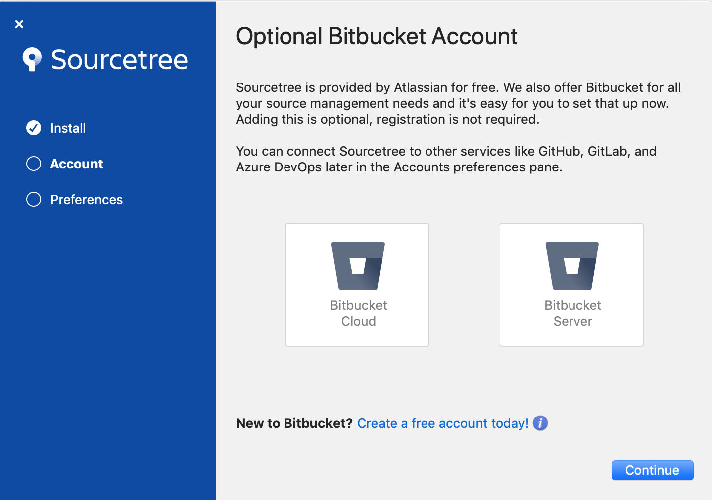
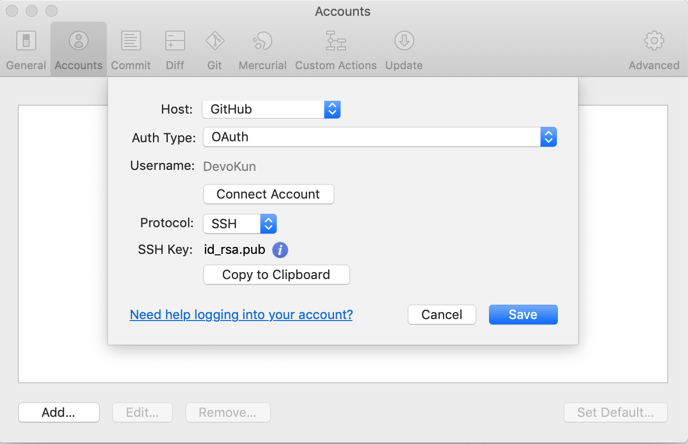
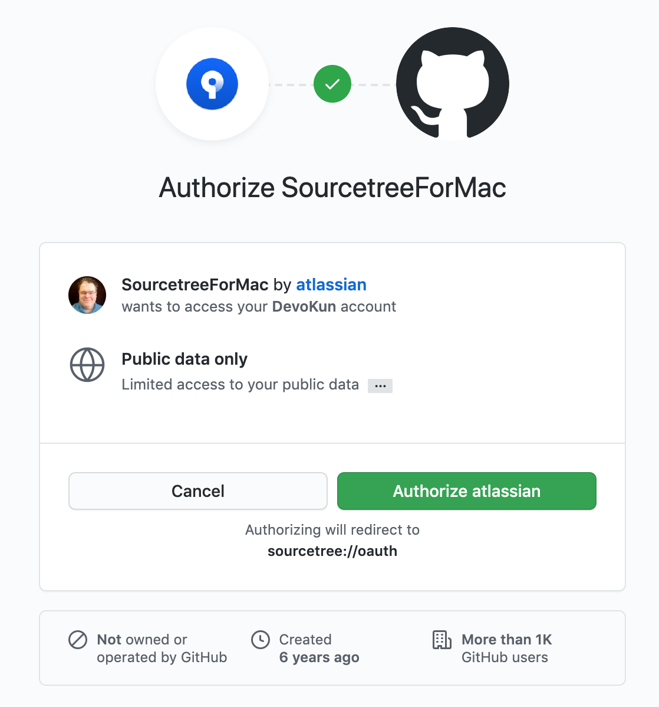
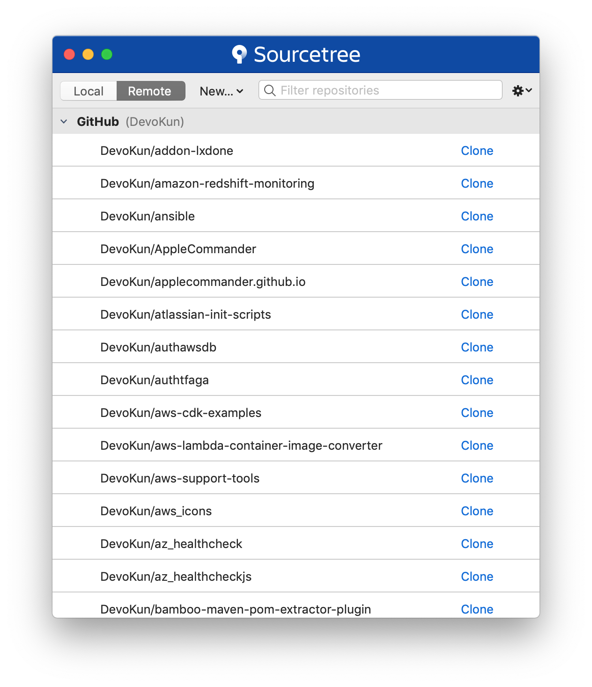

Install git for MacOS users
===========================

* [MacOS users familiar with the commandline can use the `git` client](git-for-shell-users.md)
* MacOS users looking for a GUI client should try [**Sourcetree**](https://www.sourcetreeapp.com/)

## Download and install Sourcetree

* [Download Sourcetree](https://www.sourcetreeapp.com/)
* Sourcetree is downloaded in a zip file. Expanding the zip file will reveal `Sourcetree.app`.
* Drag `Sourcetree.app` to `/Applications`

## Launch Sourcetree

### Do not create BitBucket account

### Set the display name and eMail address used when making a commit with Sourcetree

### Authorize Sourcetree to access GitHub

* Open the `Preferences`
* On the accounts tab, add a new `GitHub` account.

* The GitHub website will launch. Authorize Sourcetree to access GitHub using OAUTH.

* After a successful connection, Sourcetree will display a list of available repositories.

