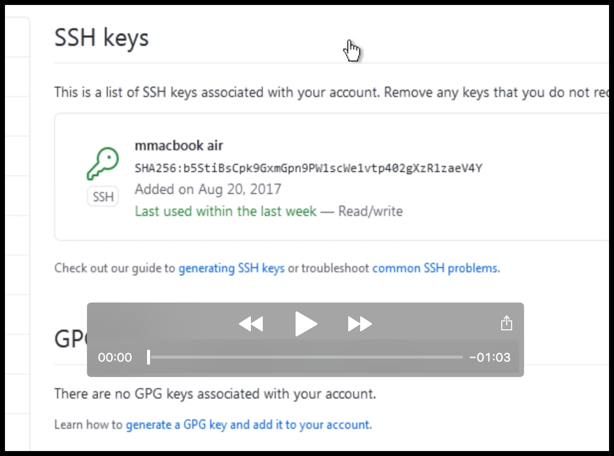

Git for Windows Users
=====================

## Download Git

### Verify if your operating system is 32-bit or 64-bit
| Windows 7                   |
|-----------------------------|
| * Click on the `Start` menu |
| * Right-Click `My Computer` |

* [Download git for Windows](https://git-scm.com/download/win)
* [Download TortoiseGit, the Windows Git Client](https://tortoisegit.org/download/)

## Install git and TortoiseGit

* TortoiseGit is a GUI tool that uses the `git` client.
* TortoiseGit will generate a new SSH key using `PuTTYgen` during installation.

* The `SSH Public Key` will be used to authorize communication with GitHub

## Add SSH Public Key to [GitHub](https://github.com/settings/keys)

