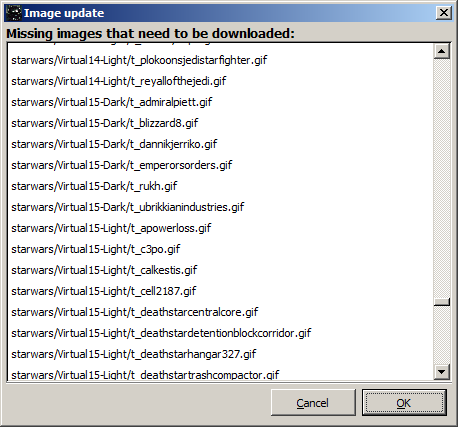
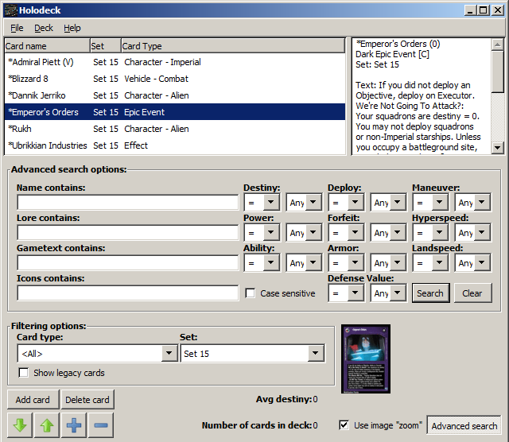
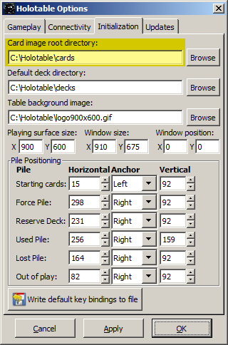
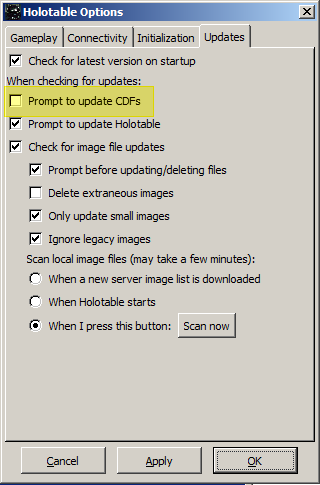

Update Holotable
================

* This repo uses up to date card data for use with **Holotable**.

* After installing Holotable on **Windows**, use the Card Data Files _(CDF)_ on this site to update Holotable to the latest SWCCG release.

* Download the [`latest.zip`](../latest.zip) bundle which includes the latest `cdf` files:
  * _[`lightside.cdf`](../lightside.cdf)_
  * _[`darkside.cdf`](../darkside.cdf)_
* Extract the zip file in to the Holotable directory. For example: `C:\holotable`
* When launching `holotable.exe` it prompts to download the latest CDF files from the `holotable.com` site. The files on `holotable.com` are out of date. The CDF files in `latest.zip` are the most up to date.
* Restart `holotable.exe`. Holotable should download the latest image files detailed in the CDF files.

* After the images are updated, when launching `holodeck.exe` the latest Virtual Sets and card images will be displayed:

### If unknown, find the Holotable directory:
* Run Holotable.
* Click on the `Table` menu
* Click on the `Options` menu item
* Click on the `Initialization` tab.
* There you will see a path for: `Card image root directory`

### Prevent `holotable.exe` from updating the CDF files
* Run Holotable.
* Click on the `Table` menu
* Click on the `Options` menu item
* Click on the `Updates` tab.
* Uncheck the option to prompt for CDF updates.

