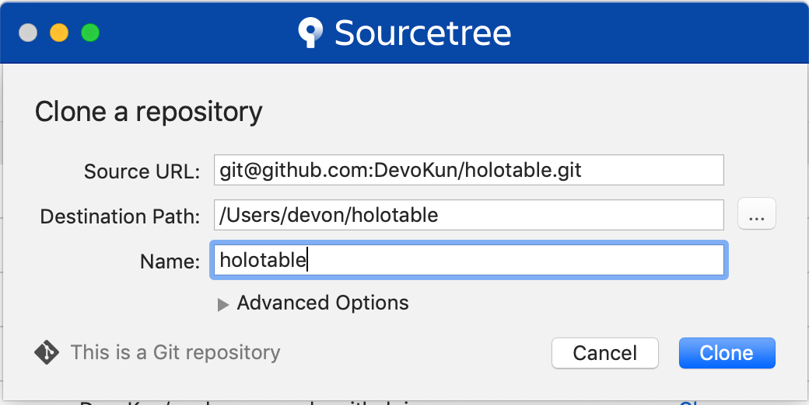
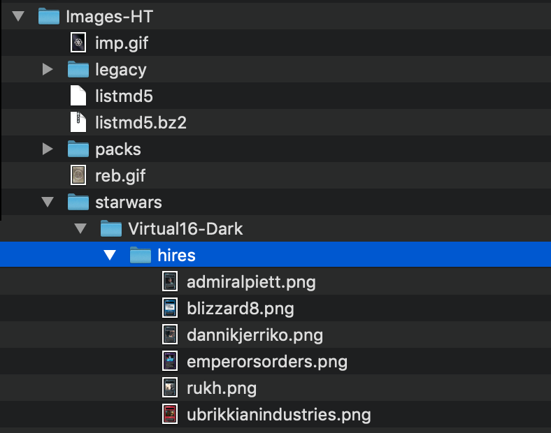

MacOS Instructions for Uploading Card Images
============================================

## Fork the [`holotable`](https://github.com/swccgpc/holotable) git repo

## Clone the fork locally

* Launch **Sourcetree**
* From the list of available GitHub repos, clone _your fork_ of `holotable`

## Add the images.
* Sets go in the `Images-HT/starwars` subdirectory.
* Create two new directories for the Virtual set, one per side.
* The _new_ png images will go in the `hires` subdirectory of the set.

## Commit the new images

## Push the images

## On the **GitHub** website, create a pull request

