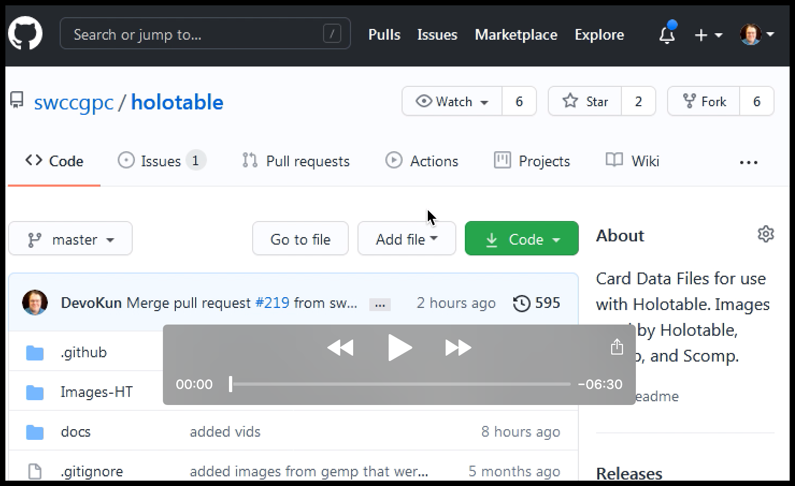

Windows Instructions for Uploading Card Images
============================================

## Fork the [`holotable`](https://github.com/swccgpc/holotable) git repo

## Clone the fork locally

* Upen up `File Explorer`.
* Choose a location where you want store your `holotable` git repo, such as `My Documents`.
* **Right-Click** the directory and select **Git Clone**

## Add the images.
* Sets go in the `Images-HT/starwars` subdirectory.
* Create two new directories for the Virtual set, one per side.
* The _new_ png images will go in the `hires` subdirectory of the set.
  * Virtual16-Light/hires
  * Virtual16-Dark/hires
* After adding the images:
  * Right click the `Virtual16-Light` directory and choose `add`
  * Right click the `Virtual16-Dark` directory and choose `add`

## Commit the new images

* Right click the `holotable` directory and choose `commit`

## Push the images

* Right click the `holotable` directory and choose `push`

## On the **GitHub** website, create a pull request

